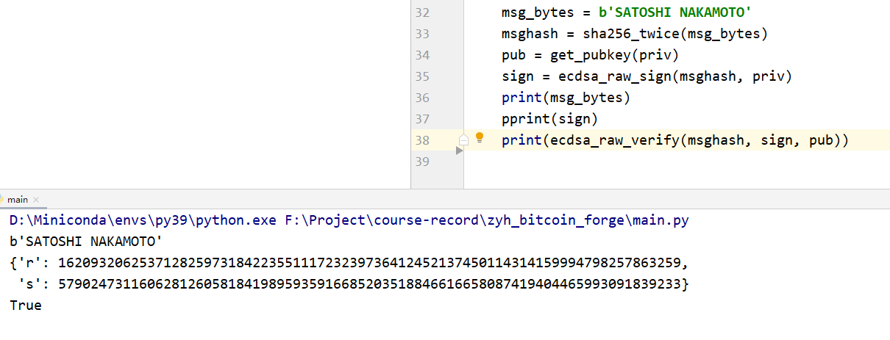
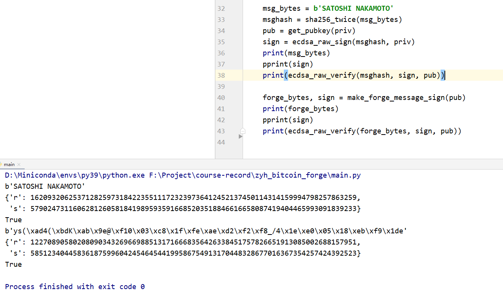

## Forge signature
### 项目说明
本项目复现的功能有：
 - secp256k1下的签名及验证
 - 已知public key、验证算法不检查message的情况下对签名进行伪造
部分代码摘自另一个项目 [bitcoin_testnet]()。

### 文件内容
**ecdsa.py**: 基于jacobi的椭圆曲线加速运算、secp256k1下的签名及验证函数  
**transform.py**: 部分hash函数、base58编解码及base58check编码  
constants.py: 常数声明  
main.py: 测试运行  
~~**[mini_ecdsa.py](https://github.com/qubd/mini_ecdsa/blob/master/mini_ecdsa.py)**: 正确签名函数，用于检查、调试~~  
~~secret.py: 储存私钥及上一轮交易信息等数据~~

### 伪造条件
假设Satoshi正在以其名字作为信息进行签名并验证，签名有效。  
  
然后已知公钥pubkey的情况下通过随机取值u、v生成签名及信息。  
对此信息及对应的签名进行验证，签名同样有效。  
  
