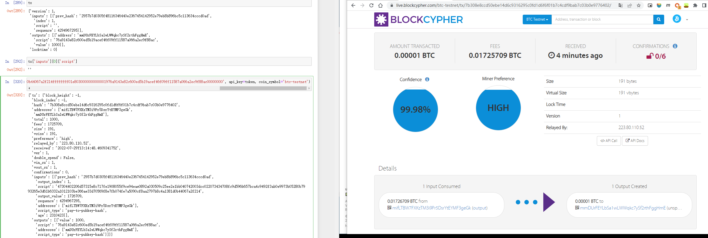
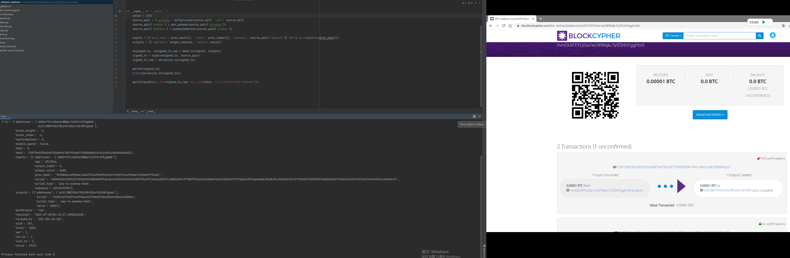

## Send a tx on test
### 项目说明
本项目复现的功能有：
 - wif转换为私钥
 - 获取公钥及公开地址
 - 构建tx

同时使用两种方法构建tx：
 - blockcypher库及api
 - 手动解析tx结构并通过部分必需信息构建tx

### 文件内容
**btc_testnet.ipynb**: blockcypher库的使用测试位于ipynb中第一部分  
**keys.py**: wif与公私钥、地址的转换  
**jacobi.py**: 基于jacobi的椭圆曲线加速运算  
**sign.py**: 对tx进行签名  
**tx.py**: 生成未签名的tx  
**transform.py**: 部分hash函数、base58编解码及base58check编码  
constants.py: 常数声明  
test.py: 测试运行  
~~secret.py: 储存私钥及上一轮交易信息等数据~~

### tx解析
对于这样一个tx raw数据
```
0100000001add0cc4c6313c1c56b898beb792e9542414567230e44466311485f30d0b75729010000006a47304402206d57315e8c717fe1908055f9ce94eae0892a030509c25ee2e1bb040742003dcc022073434708fc9d596b657bca4c9492f3ab0e9973b05280b7993265e3d61b6332a1012103be366ae33d70569f8e7fb074fe7a5090cf8aa2797b8c4a1381d0b44067a2f214ffffffff01e8030000000000001976a9143e82c600ed5b19acef46f09ff11587a066a2ec9f88ac00000000
```
 - 版本version **[0:4] 4 bytes** 01000000
 - 输入数量 **[4] 1 byte** 01
 - 输入交易0的信息
 - - 输出hash **[5:37] 32 bytes** 2957b7d0305f48116346440e2367454142952e79eb8b896bc5c113634cccd0ad
 - - 输出index **[37:41] 4 bytes** 01000000
 - - 解锁脚本长度 **[41] 1 byte** 6a
 - - 解锁脚本 **[42:148] 106 bytes** 
```python
"47304402206d57315e8c717fe1908055f9ce94eae0892a030509c25ee2e1bb040742003dcc022073434708fc9d596b657bca4c9492f3ab0e9973b05280b7993265e3d61b6332a1012103be366ae33d70569f8e7fb074fe7a5090cf8aa2797b8c4a1381d0b44067a2f214"
# 0x47 将接下来0x47 bytes数据压入栈中
# 3044...a101 数据
# 0x21 将接下来0x21 bytes数据压入栈中
# 03be...f214 数据
```
 - - 序列号 **[148:152] 4 bytes** ffffffff
 - 输出数量 **[152] 1 byte** 01
 - 输出信息
 - - 交易量 **[153:161] 8 bytes** e803000000000000
 - - 锁定脚本长度 **[161] 1 byte** 19
 - - 锁定脚本 **[162:187] 25 bytes**
```python
"76a9143e82c600ed5b19acef46f09ff11587a066a2ec9f88ac"
# 0x76 OP_DUP 复制栈顶元素
# 0xa9 OP_HASH160 对栈顶两次hash(SHA256+RIPEMD-160)
# 0x14 将接下来0x14数据压入栈中
# 3e82c600ed5b19acef46f09ff11587a066a2ec9f 数据
# 0x88 OP_EQUALVERIFY 判断栈顶两个元素是否相等并以此验证交易是否有效
# 0xac 验证交易签名是否是hash、公钥的有效签名
```
- 锁定时间**[187:191] 4 bytes**00000000

### tx发送结果
blockcypher：


自建函数tx：

